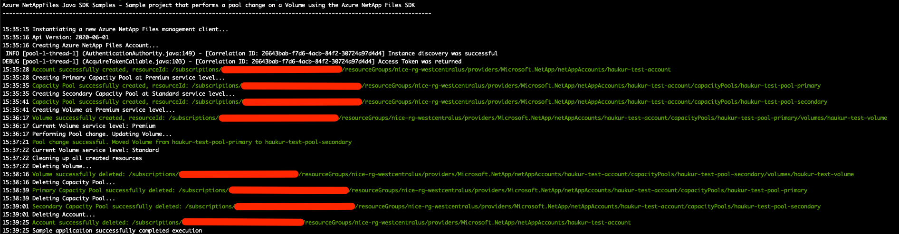

# Azure NetAppFiles SDK Sample - Pool Change for Java

This project demonstrates how to use a Java sample application to perform a pool change on a Volume for the Microsoft.NetApp
resource provider.

In this sample application we perform the following operations:

* Creations
    * ANF Account
    * Source Capacity Pool in service level Premium
    * Destination Capacity Pool in service level Standard
    * Volume in the Source pool
* Updates
    * Perform pool change, moving Volume from Premium tier capacity pool to Standard tier capacity pool
* Deletions
    * Volume
    * Source Capacity Pool
    * Destination Capacity Pool
    * ANF Account

>Note: The cleanup execution is disabled by default. If you want to run this end to end with the cleanup, please
>change value of boolean variable 'cleanup' in main.java

If you don't already have a Microsoft Azure subscription, you can get a FREE trial account [here](http://go.microsoft.com/fwlink/?LinkId=330212).

## Prerequisites

1. This project is built upon Maven, which has to be installed in order to run the sample. Instructions on installing Maven can be found on their website [here](https://maven.apache.org/install.html)
1. The sample is written in Java 11. The Maven compiler's target Java version is therefore Java 11, and the JAVA_HOME environment variable must be set to Java 11 or a newer version.
Instructions on setting JAVA_HOME can be found [here](https://mkyong.com/java/how-to-set-java_home-on-windows-10/) for windows,
and [here](https://mkyong.com/java/how-to-set-java_home-environment-variable-on-mac-os-x/) for macOS.
1. Azure subscription
1. Subscription needs to be enabled for Azure NetApp Files. For more information, please refer to
[this](https://docs.microsoft.com/azure/azure-netapp-files/azure-netapp-files-register#waitlist) document
1. (Valid only while Pool Change feature is in preview state) Request preview access for Azure NetApp Files Pool Change. For more information, please refer to [this](https://docs.microsoft.com/en-us/azure/azure-netapp-files/dynamic-change-volume-service-level#register-the-feature) document.
1. Resource Group created
1. Virtual Network with a delegated subnet to Microsoft.Netapp/volumes resource. For more information. please refer to
[Guidelines for Azure NetApp Files network planning](https://docs.microsoft.com/en-us/azure/azure-netapp-files/azure-netapp-files-network-topologies)
1. For this sample console application to work we need to authenticate. We will be using Service Principal based authentication
    1. Within an [Azure Cloud Shell](https://docs.microsoft.com/en-us/azure/cloud-shell/quickstart) session, make sure
    you're logged on at the subscription where you want to be associated with the service principal by default:
        ```bash
        az account show
       ```
         If this is not the correct subscription, use             
         ```bash
        az account set -s <subscription name or id>  
        ```
    1. Create a service principal using Azure CLI
        ```bash
        az ad sp create-for-rbac --sdk-auth
        ```
       
       >Note: This command will automatically assign RBAC contributor role to the service principal at subscription level.
       You can narrow down the scope to the specific resource group where your tests will create the resources.

    1. Copy the output contents and paste it in a file called azureauth.json, and secure it with file system permissions.
    1. Set an environment variable pointing to the file path you just created. Here is an example with Powershell and bash:
        
        Powershell
        ```powershell
        [Environment]::SetEnvironmentVariable("AZURE_AUTH_LOCATION", "C:\sdksample\azureauth.json", "User")
        ```
        Bash
        ```bash
        export AZURE_AUTH_LOCATION=/sdksamples/azureauth.json
        ```
    
## What is netappfiles-java-pool-change-sdk-sample doing?

This sample is dedicated to demonstrating how to perform a pool change on a Volume in Azure NetApp Files.
Similar to other ANF SDK examples, the authentication method is based on a service principal.
This project will first create an ANF Account and then two Capacity Pools, one at a Premium service level tier, and another at a Standard service level tier.
Then it will create a single Volume in the Premium tier Capacity Pool.
Finally, the sample will perform the pool change operation on the Volume by moving it to the Standard tier Capacity Pool.

There is a section in the code dedicated to remove created resources. By default this script will not remove all created resources;
this behavior is controlled by a boolean variable called 'cleanup' in the main class. If you want to erase all resources right after the
creation operations, set this variable to 'true'.

>Note: This sample does not have a specific retrieve section since we perform get operations in several
>places throughout the code.

## How the project is structured

The following table describes all files within this solution:

| Folder         | FileName                    | Description                                                                                                                                                                                                                                                               |
|----------------|-----------------------------|---------------------------------------------------------------------------------------------------------------------------------------------------------------------------------------------------------------------------------------------------------------------------|
| Root\\^           | main.java                   | Reads configuration, authenticates, executes all operations
| Root\\^           | Cleanup.java                | Performs the delete operations of the created resources
| Root\\^           | Creation.java               | Performs the creation operations of resources
| Root\\^           | Update.java                 | Performs the pool change operation
| Root\\^\common    | CommonSdk.java              | Class dedicated to common operations related to ANF's SDK
| Root\\^\common    | ResourceUriUtils.java       | Class that exposes a few methods that help parsing Uri's, building new Uri's, or getting a resource name from a Uri, etc
| Root\\^\common    | ServiceCredentialsAuth.java | A small support class for extracting and creating credentials from a File
| Root\\^\common    | Utils.java                  | Class that contains utility functions for writing output, retrieving AD password, etc.
>\\^ == src/main/java/poolchange/sdk/sample

## How to run the console application

1. Clone it locally
    ```powershell
    git clone https://github.com/Azure-Samples/netappfiles-java-pool-change-sdk-sample
    ```
1. Change folder to **.\netappfiles-java-pool-change-sdk-sample**
1. Make sure you have the azureauth.json and its environment variable with the path to it defined (as previously described)
1. Make sure the JAVA_HOME environment variable is pointing to version 11 of Java or newer (see Prerequisites for instructions)
1. In the main.java class, change the values of the variables within the runAsync() function to reflect your environment
1. Compile the console application
    ```powershell
    mvn clean compile
    ```
1. Run the console application
    ```powershell
    mvn exec:java -Dexec.mainClass="poolchange.sdk.sample.main"
    ```

Sample output


## References

* [Manage snapshots by using Azure NetApp Files](https://docs.microsoft.com/en-us/azure/azure-netapp-files/azure-netapp-files-manage-snapshots)
* [Resource limits for Azure NetApp Files](https://docs.microsoft.com/azure/azure-netapp-files/azure-netapp-files-resource-limits)
* [Azure Cloud Shell](https://docs.microsoft.com/azure/cloud-shell/quickstart)
* [Azure NetApp Files documentation](https://docs.microsoft.com/azure/azure-netapp-files/)
* [Download Azure SDKs](https://azure.microsoft.com/downloads/)
